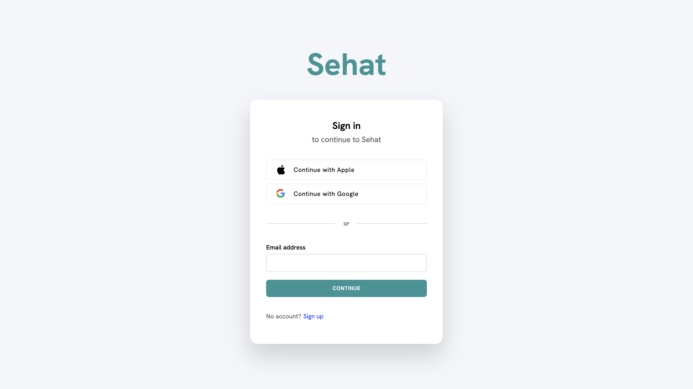

# Sehat - Healthcare Management System

### Author: Zaid Shahid (zs2329)



## 🚀 Overview
Sehat is an online healthcare management system designed to streamline various healthcare services, including:  
- **📅 Online Medical Appointment Scheduling**  
- **🩺 Healthcare Provider Search**  
- **📹 Telemedicine Consultations**  
- **💊 Digital Prescription Management**  
- **⭐ Rate and Review System**  

---

## 📌 Features
- **Patients** can book, reschedule, and cancel appointments.  
- **Search** for healthcare providers by specialty and location.  
- **Secure telemedicine** video consultations.  
- **Digital prescriptions** accessible anytime.  
- **Rate and review** system for user feedback.  

---

## 🛠 Installation & Setup

1. **Clone the repository**  
   ```sh
   git clone https://github.com/Zaid141/sehat.git
   cd sehat
   
2. **Install dependencies**  
   ```sh
   npm install

3. **Ensure MongoDB is running (local or remote connection).**  


4. **Start the sever**  
   ```sh
   cd Back
   node app.mjs

## Expected output:
  ```sh
  MongoDB database Connected
  Backend listening on port 5173
```

 ## ✅ Test Cases
Use Case 1: Medical Appointment Scheduling

    ✅ Earliest Appointment: 8:00 AM → Should be accepted.
    ❌ Latest Appointment: 5:00 PM → Should be rejected.
    ✅ Mid-Day Appointment: 12:00 PM → Should be accepted.

Use Case 2: Search for Healthcare Providers

    ✅ Valid Search: 'Cardiology' in 'Downtown' → Should return results.
    ❌ Invalid Specialty Search: 'Astrology' → Should return an error.
    ✅ Uncommon Search Combination: 'Pediatrics' + 'Late Night' → Should return results or a message.

Use Case 3: Rating & Reviews

    ✅ Valid Rating: 4-star review → Should be accepted.
    ❌ Pre-Consultation Rating Attempt: Should be rejected.
    ✅ Review Without Text: Should accept star rating without text.

Use Case 4: Digital Prescription Management

    ✅ Valid Prescription Entry: Should store prescription correctly.
    ❌ Missing Dosage Info: Should be rejected.
    ✅ Access After Hours: Should be accessible at any time.

Use Case 5: Telemedicine Consultations

    ✅ On-Time Consultation: Should connect successfully.
    ❌ Poor Internet Connection: Should provide alternative options.
    ✅ Reschedule Missed Appointment: Should allow easy rescheduling.

## 🔍 Binary Search Bug & Fix

A data flow anomaly in the binary search algorithm was identified and fixed.

**❌ Original Issue:**
```sh
mid = mid - 1;  // Incorrect reassignment before high update
```

This caused unnecessary redefinition of mid, leading to potential errors.

**✅ Fixed Code:**
```sh 
int modifiedbinsearch(int X, int V[], int n) {
    int low = 0, high = n - 1, mid;
    
    while (low <= high) {
        mid = (low + high) / 2;
        
        if (X < V[mid]) {
            high = mid - 1;
        } else if (X > V[mid]) {
            low = mid + 1;
        } else {
            return mid;
        }
    }
    
    return -1;
}
```

## 📜 License

This project is open-source under the MIT License.
